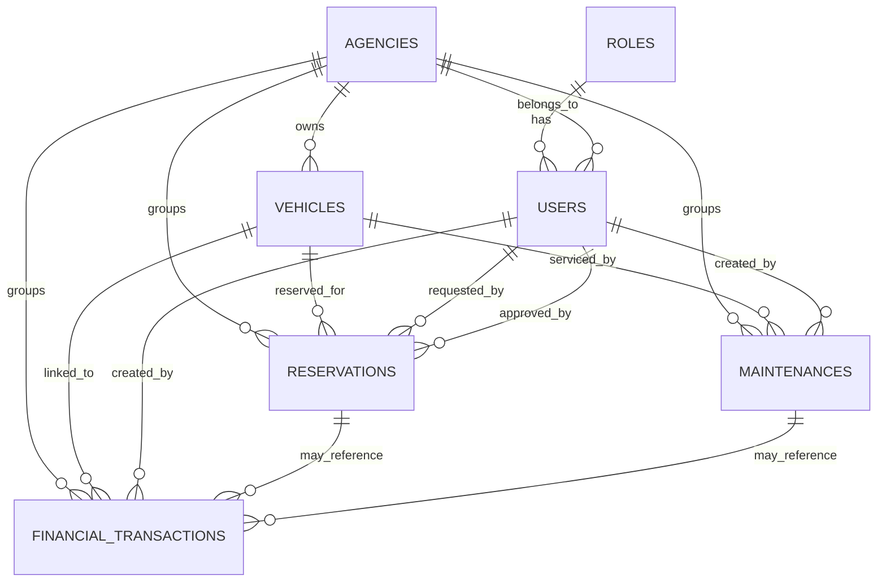

# Fleet Management Foundation

## Architecture

- Backend: Laravel 12, thin controllers, form requests, Eloquent models, policies later if needed.
- Frontend: Inertia + React + Tailwind + shadcn/ui, with shared page components and route-level pages.
- Database: MySQL-compatible Laravel migrations, also safe for PostgreSQL with the current schema choices.
- Product scope: authentication, core fleet master data, reservations, maintenance, and finance tracking.

## MVP Boundaries

- Users can sign in and access the app.
- Roles determine access level.
- Agencies group the operational data.
- Vehicles are the primary asset.
- Reservations track planned vehicle usage.
- Maintenances track service history.
- Financial transactions track income and expense records.

## ERD

## Tables

- `roles`: system roles for access control.
- `agencies`: operational locations or business units.
- `users`: authenticated users with optional role and agency membership.
- `vehicles`: fleet assets.
- `reservations`: planned vehicle usage.
- `maintenances`: service and repair records.
- `financial_transactions`: income and expense entries.

## Implementation Notes

- Use soft deletes for records that should remain auditable.
- Keep foreign keys simple and direct.
- Store external API mappings with `external_source` and `external_id`.
- Use nullable links for optional relationships instead of polymorphic complexity.
